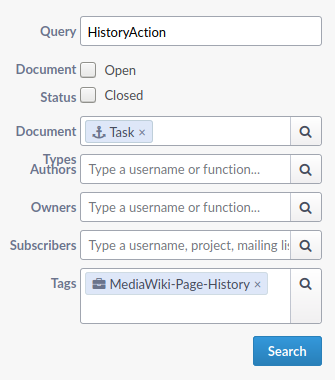
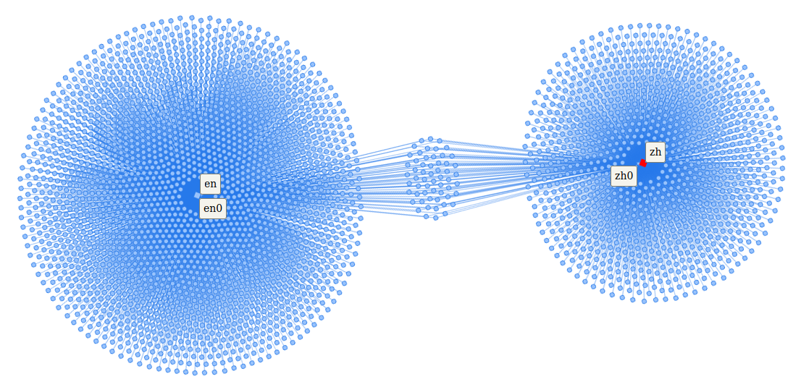
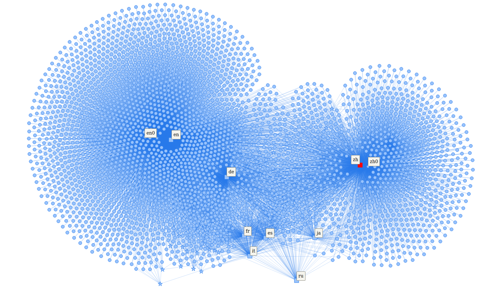
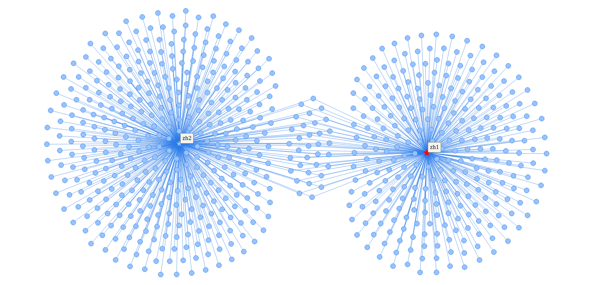
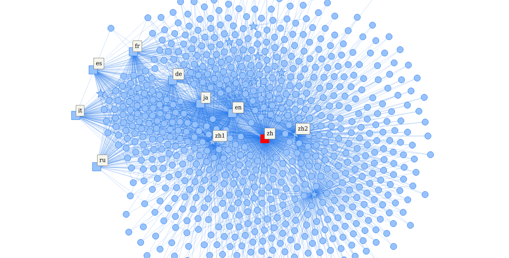
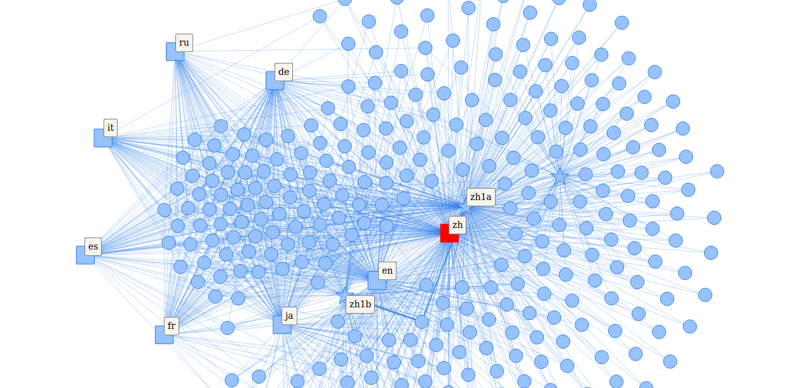
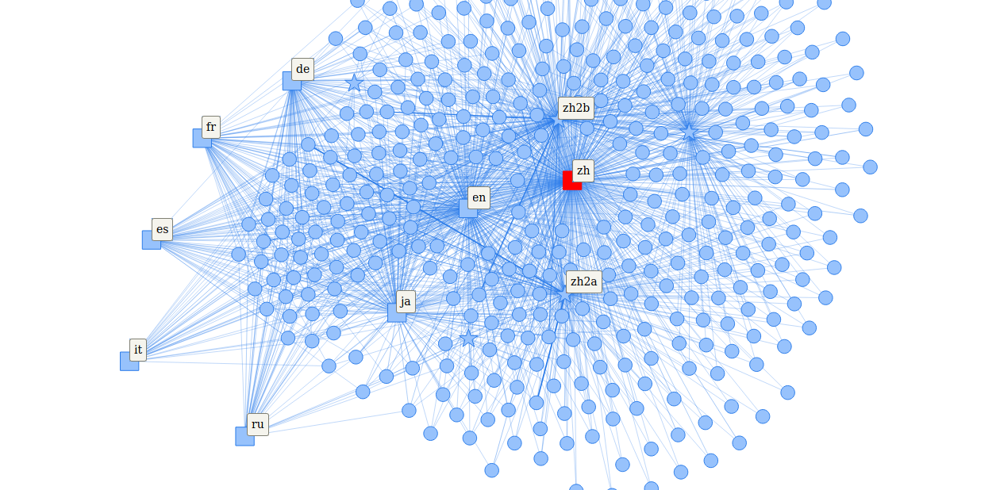
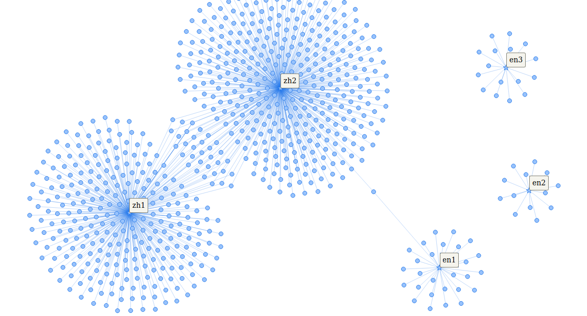

# Kapitel 3 - Fallbeispiel: *1989 Tiananmen Square protests*

Die Artikel zur gewaltsamen Niederschlagung der Proteste auf dem Tiananmen-Platz 1989 sollen diesem Fallbeispiel als Untersuchungsgegenstand dienen. Schon die Wahl der Titel in den unterschiedlichen Sprachversionen der Wikipedia zeigt die ausgeprägte Varianz in der Darstellung des Themas. So Lautet der deutsche Titel Tian’anmen-Massaker, der englische 1989 Tiananmen Square protests und der chinesische kann als six-four incident übersetzt werden. Innerhalb der Volksrepublik China wird dieser Vorfall als Tabuthema betrachtet und systematisch zensiert. [^103] Wiederholt wurde dieser Anspruch auf Deutungshoheit auf Diskursräume jenseits der Grenzen Chinas ausgeweitet, wobei insbesondere die wirtschaftliche Funktion des Landes eine zentrale Rolle spielte. So führte 2019 ein Werbefilm des deutschen Kameraherstellers Leica zu einem Aufschrei in China, da in einer kurzen Sequenz das weltbekannte Bild des Tank mans zu sehen war. [^104] 2020 sperrte China einen Trailer des Computerspiele Publishers Activision, da in diesem ebenfalls in einem kurzen Ausschnitt die Proteste von 1989 gezeigt wurden. [^105]

Zwischen dem chinesischen und dem englischen Artikel sind somit sowohl inhaltlich als auch in der Zusammensetzung der Autoren gewichtige Unterschiede zu erwarten. Im Folgenden werden die genuin digitalen Quellen entsprechend der zuvor erläuterten Methodik einer digital-historischen Quellenkritik unterzogen. Der Fokus gilt dabei der Validität der digitalen Objekte sowie der Kritik der anonymen Autorengruppen der zu untersuchenden Artikel.

## 3.1 Heuristik

Ausgangspunkt der Untersuchung ist der Artikel 1989 Tiananmen Square protests (im Folgenden als en⁰ bezeichnet) der englischen Sprachversion der Wikipedia. [^106] Diese nimmt im Netz der Sprachversionen eine besondere Rolle ein. Nicht nur wurde mit ihr das Projekt Wikipedia ursprünglich ins Leben gerufen, sie ist auch bis heute die aktivste und umfassendste Sprachversion des Projekts. [^107] Weiterhin nimmt sie eine vermittelnde Funktion unter den zahlreichen Sprachversionen ein, indem sie regelmäßig als Quelle oder Ziel von Übersetzungs­vorhaben dient. Ban, Perc und Levnajić zeigten, dass Übersetzungs­leistungen nicht gleich verteilt zwischen Sprachversionen stattfänden, sondern sich bevorzugt innerhalb bestimmter Cluster abspielten. Ausgenommen von diesem Phänomen sei jedoch die englische Sprachversion, die sich keinem der ermittelten Cluster zuordnen lasse. [^108] Dank ihrer Rolle als lingua franca beteiligen sich insbesondere viele nicht-muttersprachliche User aktiv an der Gestaltung dieser Wikipedia. Nach Kim (et al.) seien die Beiträge nicht-muttersprachlicher User in ihrer sprachlichen Komplexität und der Auswahl der Artikel kaum von den mutter­sprachlichen Usern zu unterscheiden. Gleichwohl zeige sich, dass auch multilinguale User bevorzugt in ihrer jeweiligen Muttersprache und folglich der entsprechenden Sprach­version der Wikipedia schreiben würden. [^109] Die englischsprachige Wikipedia ist wegen ihrer außerordentlichen Relevanz sowie des intensiven interkulturellen Diskurses somit eine ausgezeichnete Vergleichsbasis.

Fokus dieser Untersuchung ist die Bewertung der Schreibakte der Autoren als Teil einer inneren Quellenkritik. Jedem Artikel kann über die Teilnahme am editorischen Prozess eine Gruppe an Usern zugewiesen werden. Die zuvor genannten Untersuchungen lassen vermuten, dass diese Gruppe bei einem Artikel der englischsprachigen Wikipedia vergleichsweise heterogen im Sinne einer sprachlichen oder nationalen Zuordnung ist. Da Useraccounts jedoch systemweit einzigartig vergeben werden, kann über den Benutzernamen eine Beteiligung an Schreibprozessen in verschiedenen Sprachversionen nachgewiesen werden.

Ein möglicher Ansatz zur Beurteilung von Nutzergruppen ist die Suche nach Schnittmengen in Artikeln unterschiedlicher Sprachversionen. Der Artikel 六四事件  (ab hier: *zh⁰*) ist das chinesische Gegenstück zu en⁰ und soll fortan die Vergleichsbasis zu diesem darstellen. [^110] Die chinesische Sprachversion ist ähnlich der englischen Version ein Sonderfall in der Wikipedia. Bis etwa Ende 2014 war sie auch innerhalb der Volksrepublik China erreichbar, was sich mit dem Jahresbeginn 2015 jedoch änderte. Ab etwa 2015 wurde der Zugriff auf die chinesische Sprachversion, analog zur restlichen Wikipedia, für Internetteilnehmer innerhalb Chinas gesperrt. Es kann daher davon ausgegangen werden, dass die chinesischsprachige Wikipedia vor 2015 hauptsächlich durch den Einfluss von Usern aus der VRC geprägt wurde, während nach 2015 insbesondere User aus anderen Ländern, wie z.B. der Republik China (Taiwan) oder Hong Kong, die Artikel bearbeiteten. [^111] Diese Änderung der Nutzerbasis führte zu einem veränderten Umgang mit für die Kommunistische Partei Chinas sensiblen Themen. [^112] Die Zeitachse mit einbeziehend, sind für zh⁰ somit zwei unterschiedlich zu charakterisierende Akteursgruppen anzunehmen, die auf Schnittmengen mit der Akteursgruppe von en⁰ abgeglichen werden sollen.

Zusätzlich zum Ansatz eines Gruppenvergleichs auf Grundlage hermeneutisch ermittelter Artikel bietet sich weiterhin eine Analyse auf Ebene der Akteure selbst an. Ähnlich der Artikelhistorie, bei der die einzelnen Artikelversionen eines Artikels chronologisch aufgelistet werden, verfügt die Wikipedia zudem über die Funktion der *User Contributions* oder *Benutzerbeiträge*. Diese Funktion listet die Beiträge eines spezifischen Users chronologisch auf, wodurch dessen Schreibakte artikelübergreifend nachvollziehbar werden. Jedoch ist diese Funktion stets auf die aktuelle Sprachversion begrenzt, obwohl die Useraccounts selbst sprachversionsübergreifend gestaltet sind. Um Aktivitäten in anderen Sprachversionen zu inkludieren, muss je Sprache eine eigene Abfrage der User Contributions durchgeführt werden.

Neben dem beschränkten Wirkungsbereich der User Contributions erzwingt auch die sprachsensible Formatierung der Wikipedia eine explizite Auswahl zu untersuchender Sprachversionen im Vorfeld der Datenerhebung. Insbesondere die Formatierung der Datumsangaben sowie einige Details im HTML der zu untersuchenden Seiten variieren teils beträchtlich je nach Sprachversion, worauf u.a. mit einer entsprechenden Übersetzung der Datumsangaben reagiert werden muss.[^113] Den zuvor ausgewählten Artikeln entsprechend, sind für diese Untersuchung mindestens die Sprachversionen Chinesisch (*zh*) und Englisch (*en*) in Betracht zu ziehen. Da die Wikipedia in etwa dreihundert Sprachversionen vorliegt und für einen signifikanten Anteil dieser Sprachen Anpassungen an den Skripten zur Datenerhebung vorzunehmen wären, ist der Anspruch einer vollständigen Erfassung im Rahmen dieser Arbeit nicht zielführend. Stattdessen erscheint es sinnvoll, Sprachversionen gemäß ihrer Aktivität mit in die Untersuchung aufzunehmen. Als Indikator für die Aktivität wird hier die Anzahl aktiver Benutzer einer Sprachversion benutzt. Dementsprechend werden zusätzlich zu den oben genannten folgende Sprachversionen in dieser Untersuchung mit einbezogen: Deutsch (*de*), Französisch (*fr*), Spanisch (*es*), Japanisch (*ja*), Russisch (*ru*) sowie Italienisch (*it*). [^114] Durch diese Metrik wird verhindert, dass Sprachversionen mit geringer Benutzerzahl aber sehr hoher Botaktivität untersucht werden. [^115]

## 3.2 Äußere Kritik: Validierung der digitalen Objekte

Gegenstand der äußeren Quellenkritik sind die digitalen Objekte *Article History* sowie *User Contributions* der Wikipedia, die zum Zeitpunkt der Untersuchung und Datenerhebung unter der Software MediaWiki in Version 1.36.0-wmf.4 (98d11b3) lief. [^116] Da die hier vorgestellte genuin digitale äußere Quellenkritik die zu Grunde liegenden Prozesse und die technische Implementation adressiert, können die zuvor ermittelten Untersuchungsgegenstände *en⁰* und *zh⁰* sowie die Benutzerbeitragslisten der zugehörigen User ignoriert werden, da es sich dabei um Instanzen der zu untersuchenden digitalen Objekte handelt.

Ziel ist es somit, die Integrität der zu untersuchenden Daten durch eine Analyse der Software­architektur und Daten­verarbeitung zu bewerten. Als Indikator für Abweichungen vom Erwartungswert dient hierbei das zum MediaWiki gehörende Bugtracking-Portal *Phabricator*. Zur Identifikation von Programmfehlern wird dort die unscharfe Bezeichnung Task verwendet. In diese Kategorie fallen zudem auch neue Anforderungen an die Software sowie unspezifische Auffälligkeiten oder Anmerkungen. Erst aus der *Description* wird ersichtlich, um welchen Typ es sich beim vorliegenden Task handelt. In Anbetracht der Offenheit des Systems und der Relevanz des Projektes Wikipedia kann bei negativem Befund mit relativer Sicherheit davon ausgegangen werden, dass keine Anomalien in der untersuchten Datenverarbeitung auftreten. Neben offenen Tasks sind für die Bewertung der digitalen Objekte auch bereits geschlossene Tasks von Interesse. Dort könnten Hinweise auf Fehler zu finden sein, die sich dauerhaft auf die vorliegende Datenbasis ausgewirkt haben. In diesem Fall wäre zu prüfen, ob die Datenbasis retrospektiv korrigiert wurde.

Für eine erfolgreiche Recherche in Phabricator muss zunächst die Architektur der betroffenen Objekte analysiert werden, damit die betroffenen Komponenten der Software eindeutig identifiziert werden können. Hilfreiche Ressourcen zur Einarbeitung in das System sind das MediaWiki Handbuch, die Community Seite *Developer Hub* sowie die Klassen­referenz, in der die strukturierten Quellcodekommentare zusammengefasst vorliegen. [^117]

Wie bereits in Kapitel [2.1 Zur Struktur des digitalen Objekts Artikel](https://krugbuild.github.io/fluechtig-anonym-digital/blob/master/Kapitel_2.md#21-zur-struktur-des-digitalen-objekts-artikel) dargelegt, bestehen Artikel aus einer Reihe an einzelnen Artikelversionen, welche die eigentlichen Informationsträger des digitalen Objektes darstellen. Diese Artikelversionen werden im Quellcode von der abstrakten Klasse *RevisionItemBase* abgeleitet und tragen die Bezeichnung *RevDelRevisionItem*. [^118] Für diese Untersuchung sind drei Funktionen von Interesse, die auf diese Klasse zugreifen: das Laden einzelner Artikelversionen, das Laden einer Liste von Artikelversionen sowie das Speichern von Artikelversionen.

Das Laden einer bestimmten Artikelversion wird beim Aufrufen eines Wikipediaartikels ausgeführt. Die für die Artikel verantwortliche Klasse heißt *Article* und diese ruft über die Funktion *fetchRevisionRecord()* die jeweils aktuelle Artikelversion ab. [^119] Das Öffnen der Artikelhistorie führt zum Aufruf der Klasse *HistoryAction*, die über die Funktion *fetchRevisions()* mehrere Artikelhistorien als Liste lädt. [^120] Beim Speichern hingegen wird zunächst über eine *EditAction* die Klasse *EditPage* aufgerufen, von der aus via *attemptSave()* eine neue Revision erstellt werden kann. [^121]

Ergänzend zu den Artikelversionen sind für die vorliegende Untersuchung die Benutzer­beiträge von Interesse. Diese werden mit der Klasse *ContribsPager* abgebildet, die über die Funktion *formatRow()* die jeweiligen Artikel­versionen abruft. [^122]

`Abbildung 5: Suchmaske des Trackingtools Phabricator.`

Die relevanten Prozesse im Umgang mit Artikelversionen umfassen also die Klassen *Article*, *HistoryAction*, *EditAction*, *EditPage*, *RevDelRevisionItem* sowie *ContribsPager*. Über diese Suchbegriffe können nun relevante Tasks in Phabricator ermittelt werden. [^123] Die Suche verknüpft hierbei Suchbegriffe stets mit einem logischen AND, wodurch separate Such­durchläufe je Begriff notwendig sind. Eine Einschränkung des *Document-Types* auf *Task* vermeidet die Anzeige irrelevanter Ergebnis­arten. Das Feld *Tags* bietet weiterhin die Möglichkeit, die Suche auf bestimmte Komponenten einzuschränken. Hier bieten sich zur Beschränkung auf die relevanten Themengebiete die Einträge *MediaWiki-Page-History* sowie *MediaWiki-Page-Editing* an.

Die Recherche ergab hierbei keine Hinweise auf fehlerhafte Prozesse oder inkonsistente Daten, die Datenbasis kann somit als integer betrachtet werden.

## 3.3 Datenbezug und Sicherung

Der Bezug der zu untersuchenden Daten ist prozessual eng mit deren Sicherung im Rahmen eines Research Driven Archiving verknüpft. [^124] Zur besseren Lesbarkeit werden diese Prozesse im Folgenden jedoch nacheinander behandelt.

Die Wikipedia richtet sich mit ihrem Angebot und ihrer Gestaltung an menschliche User, doch erst durch eine zumindest teilautomatisierte Erhebung und Auswertung der genuin digitalen Quellen werden deren Vorzüge klar. Der Zugang zu und folglich das Abrufen der Daten aus der Wikipedia stellen die Voraussetzung für alle weiteren Schritte dar. In der Wikipedistik haben sich hierzu vorrangig zwei Zugriffsmöglichkeiten auf die Inhalte der Wikipedia etabliert. Der technisch naheliegende Weg ist der Zugriff über die API des MediaWikis. [^125] Diese Schnittstelle ermöglicht zwar einen direkten Zugriff auf die Inhalte der Wikipedia, jedoch sind darüber nicht alle gewohnten Funktionen des Webinterface zugänglich. So bemängeln Sahle und Henny zu Recht, dass Suchkriterien nicht kombinierbar und Einschränkung auf bestimmte Artikelteile zu unpräzise seien. [^126] Zudem verlangt der Einsatz dieser spezialisierten API eine gewisse Einarbeitungszeit, wobei sich das angeeignete Wissen schwerlich auf andere Quellenkorpora übertragen lässt.

Vielversprechender erschient hingegen die Auswertung der HTML-Dateien unter Einsatz von XML, XPath und XSLT, zumal der Einsatz der *Extensible Markup Language* ein übliches Vorgehen zur teilautomatisierten Auswertung von Daten darstellt. Dank der sprachstrukturellen Ähnlichkeit können HTML-Dokumente zudem direkt mit Mitteln der X-Technologien verarbeitet werden. [^127] Weiterhin entspricht der Zugriff auf die Daten über die formatierten HTML-Seiten am ehesten dem Zugriff durch einen realen User und die anfallenden Zwischenergebnisse können direkt mit den online vorliegenden Informationen abgeglichen werden. Zwar ist es anzunehmen, dass der Weg über die API gleichartige Ergebnisse liefern würde, jedoch hat dieser Prozess keine realweltliche Entsprechung und deckt sich nicht mit typischem Benutzerverhalten. Die Nutzung der selben Anzeigeschicht führt weiterhin dazu, dass auch etwaige Fehler im System sich auf die selbe Weise auf die Datenerhebung auswirken, wie auf die Nutzung durch menschliche User. Das zu implementierende Logging des Datenabrufs ist bei einem Zugriff über die HTML-Seiten ebenfalls besser nachvollziehbar zu gestalten, da auch hier die Parallele zum üblichen Anwendungsfall besteht.

Sahle und Henny weisen jedoch darauf hin, dass Änderungen in der HTML-Struktur der Wikipediaartikel, wie sie im Rahmen von Softwareupdates vorstellbar sind, zu Inkompatibilitäten mit der Auswertungssoftware führen können. Dies würde die Nachnutzungsmöglichkeiten der Software beeinträchtigen. [^128] Dieser Nachteil kann jedoch durch den Einsatz von XSLT-Skripten zur Interpretation der HTML-Dateien relativiert werden. Diese Skripte dienen in diesem Fall als Schnittstelle zwischen Quelldatei und Arbeitskopie. Anpassungen an Strukturänderungen würden sich somit auf diese Skripte beschränken. Weiterhin sind diese für die Sicherung der Arbeitsdaten verantwortlich.

Sowohl der Datenbezug, als auch die Quellensicherung und die Visualisierung der Akteursnetzwerke wurden vom Autor unter Verwendung von Python 3.6 implementiert. Die zentrale Funktionslogik wurde in der Klasse *UserNetwork* gebündelt, für die fallabhängigen Funktionsaufrufe sowie die Implementation der Netzwerkvisualisierung *pyvis* wurden separate Skripte angelegt. [^129] Als Entwicklungsumgebung kam Spyder in der Version 3.2.6 zum Einsatz.

Der erste Schritt des Datenbezugs ist der eigentliche Abruf der HTML-Seiten, was hier über die Library *Requests: HTTP for Humans* implementiert wurde. [^130] Anhand einer definierten URL gibt *requests* ein Objekt mit plain HTML Text zurück, das anschließend weiterverarbeitet werden kann. Da die URLs parametrisiert sind, können diese entsprechen zerlegt oder konstruiert werden. Zentral hierfür sind der *action-* sowie *title-*Parameter des MediaWikis. Mit diesen kann statt einem Artikel dessen Artikelhistorie oder statt einer Benutzerseite die Liste der Benutzerbeiträge geladen werden. Der parametrisierte Aufruf der Versionsgeschichte zu *en⁰* mit maximal fünfhundert Einträgen sieht dementsprechend wie folgt aus:

`https://en.wikipedia.org/w/index.php?title=1989_Tiananmen_Square_protests&action=history&limit=500`

Der Artikel selbst wird über den *title*-Parameter durch einen einmaligen Artikeltitel identifiziert, während die Tiefe der Artikelhistorie mittels *limit* beschränkt wird. Die Parameter sind optional solange das Zieldokument selbst identifiziert werden kann. Bei einem Aufruf einer spezifischen Artikelversion über den *oldid*-Parameter kann dementsprechend auf den *title*-Parameter verzichtet werden, da die Versions-ID ebenfalls einen einmaligen Identifikator darstellt. Der Aufruf der *en⁰*-Version vom 26.06.2020 kann somit wie folgt verkürzt werden:

`https://en.wikipedia.org/w/index.php?oldid=964661527`

Diese direkte Adressierung über die Versions-ID erleichtert den automatisierten Abruf von Artikelversionen, da dieses Format standardisiert ist und im Gegensatz zu sprachabhängigen Titeln keine Kodierungsprobleme zu erwarten sind.

Die so bezogenen HTML-Texte könnten nun im Sinne des *Research Driven Archiving* als Abbild der digitalen Objekte lokal gespeichert werden. Da die Untersuchung sich jedoch auf die Relationen zwischen Usern und Artikeln konzentriert, würden damit auch viele Daten gesichert werden, die kein Bestandteil der eigentlichen Auswertung sind. Durch die Erhebung der Daten durch teilautomatisierte Verfahren ist der Abruf tausender Datensätze für einzelne Analysen nicht unwahrscheinlich, dementsprechend scheint es im Sinne der Datensparsamkeit geboten zu sein, die Sicherung der Arbeitsdaten auf die tatsächlich untersuchten Datensätze zu beschränken. Die Falsifizierbarkeit der Untersuchung ist somit auch ohne Zugriff auf die Originaldaten möglich und durch eine automatisierte Protokollierung der Datenverarbeitung ist eine retrospektive Analyse der ursprünglichen Daten ebenfalls gegeben.

Die HTML-Texte werden im Folgenden daher mittels XSLT-Schemata in ein reduziertes XML-Format überführt und anschließend lokal gespeichert. [^131] Für jede HTML-Seite wird ein eigenes Schema benötigt, um die jeweilige Struktur des HTML-Textes korrekt übersetzen zu können. Durch die Offenlegung des Quelltextes der Schemata wird die Nachvollziehbarkeit der Transformation der Daten sichergestellt. Die Übersetzung der HTML-Texte in das spezielle XML-Format schließt im Quellcode direkt an den Datenabruf an und wurde mit Hilfe der *etree* API aus der *lxml* Library implementiert. [^132] Der Parameter *stylesheet* erwartet hierbei die Angabe des zur abzurufenden HTML-Seite passenden XSLT-Schemata. Nach erfolgreicher Transformation wird das erzeugte XML-Objekt zunächst lokal gesichert, bevor es weiterverarbeitet werden kann. Um unnötiges Abrufen von Daten zu vermeiden, wird dabei anhand des Dateinamens auf möglicherweise bereits vorhandene XML-Dateien geprüft und bei Erfolg diese geladen. Der Dateiname setzt sich aus der Angabe eines Unterordners, der Sprachversion sowie dem Querystring des Abfrageziels zusammen.

Diese XML-Objekte repräsentieren jeweils eine HTML-Seite, entweder die Artikelhistorie oder die Benutzerbeiträge, mit *n* einzelnen Datensätzen. Jeder Datensatz entspricht dabei entweder einem Artikel oder einem User. Für die anschließende Netzwerkanalyse müssen diesen zunächst aggregiert und verknüpft werden. Netzwerke werden üblicherweise durch *nodes* (Knotenpunkte) und *edges* (Kanten bzw. Relationen) beschrieben. Sowohl Artikel als auch User sind eigenständige Entitäten und werden somit als *nodes* betrachtet. Die Relationen zwischen einzelnen Nodes, also insbesondere zwischen Artikeln und den zugehörigen Autoren, müssen jedoch explizit erzeugt werden. Diese *edges* definieren sich daher durch die Kombination eines Artikeltitels mit einem Benutzernamen.

Die Funktion zum Auslesen der Artikelhistorien ermittelt zunächst das Sprachkennzeichen aus dem XML-Objekt und anschließend den Titel des Artikels. [^133] Die Informationen werden mittels XPath-Ausdrücken adressiert und über eine lokale Funktion in die Liste der *nodes* geschrieben. Ein *node* besteht aus einem einmaligen Bezeichner (Titel oder Username), seiner Klasse (Artikel oder User), dem zum Eintrag gehörigen Sprachkürzel mitsamt der Sprachhäufigkeit, die beim Einlesen stets *1* beträgt. Anschließend wird für jede Artikelversion der zugehörige User ermittelt und ebenfalls der Liste der *nodes* hinzugefügt. Benutzern wird initial keine Sprachzugehörigkeit zugewiesen, da diese nur über eine Analyse aller Beiträge eines Users approximiert werden kann. Das Änderungsdatum sowie die ID der Artikelversion werden anschließend als Relation zwischen User und Artikel in die Liste der *edges* geschrieben. Analog zu dieser Methodik werden auch die Benutzerbeiträge ausgewertet.

Zusätzlich zur Speicherung der einzelnen XML-Dateien können diese komplexen Listen als CSV-Dateien lokal gespeichert werden. Somit können die Arbeitsdaten zusätzlich zur Sicherung nach Herkunft auch fallbezogen für spezifische Analysen gesichert werden.

## 3.4 Innere Quellenkritik - Analyse der Akteure

Die Autoren der Wikipedia arbeiten stets unter pseudonymen Benutzerkonten. Zwar gibt es durchaus auch Autoren, die Klarnamen verwenden und das unter Umständen auch auf ihrer Benutzerseite deklarieren, doch müssen wir diese Egodokumente in Anbetracht der fehlenden Validierungsmöglichkeiten, zumindest bei Massenauswertungen, als unzuverlässig betrachten. Die Autoren sind als anonym zu behandeln. Eine Kritik dieser Autorschaft sollte sich dementsprechend auf ihre Schreibakte konzentrieren. [^134]

Um diese Informationen auswerten zu können, müssen die erhobenen Daten zunächst aufbereitet werden. Die Zuordnung eines Artikels zu einer Sprache ist offensichtlich und wird dementsprechend direkt bei Datenabruf im entsprechenden Knotenpunkt notiert. Aufgrund der globalen Gültigkeit der Benutzeraccounts können die Sprachkenntnisse der User initial nicht bewertet werden, weshalb die zugehörigen Knotenpunkte einen Leereintrag erhalten. Über die Auswertung der Relationen der Benutzer mit Artikeln aus verschiedenen Sprachversionen lassen sich die Sprachkenntnisse der User ermitteln. Hierzu prüft die Funktion *compute_language()* sämtliche einem User zugeordneten Artikel und notiert deren Sprachkennzeichen sowie die Häufigkeit im Knotenpunkt des Users. [^135] Den Nutzern werden somit Sprach­fertigkeiten zugewiesen, die nach der Häufigkeit der jeweiligen Schreibakte gewichtet sind. Somit wird die sprachliche Herkunft der User auf Grundlage ihrer Handlungen und nicht ihrer Eigendarstellung bewertet.

Zur Darstellung dieser gewichteten Sprachkenntnisse innerhalb eines Akteursnetzwerkes werden den Sprachen eigene Knotenpunkte zugewiesen. Die Gewichtung der Sprachkenntnisse einzelner User wird hierbei auf zwei Arten visualisiert. Durch eine Verknüpfung der Sprachhäufigkeit mit der Linienstärke im Netzwerk können individuelle Relationen sichtbar gemacht werden. Dynamische Netzwerkdarstellungen mit Physiksimulationen ermöglichen es zudem, der Sprachgewichtung eine virtuelle Anziehungskraft zuzuweisen, wodurch die Position der Sprachversionsknoten im Netzwerk sowie die Gruppierung der restlichen Knoten einen direkten Eindruck der Sprachverteilung im untersuchten Ausschnitt ermöglicht.

Da die Bestimmung der Sprachkenntnisse der User somit von den untersuchten Artikeln abhängt, würden in einer direkt vergleichenden Untersuchung, wie der Gegenüberstellung von *en⁰* und *zh⁰*, dementsprechend nur die den Artikeln zugehörigen Sprachen in Betracht gezogen werden. Um weitere Sprachkenntnisse der User zu erheben, muss zunächst auf deren Benutzerbeiträge in anderen Sprachversionen geprüft werden.

Hierzu ruft die Funktion *add_usercontributions()* für jeden User in der Liste *nodes* oder für eine als Parameter übergebene Liste an Usern die Benutzerbeiträge in allen definierten Sprachversionen ab. [^136] Hierbei kann über den Parameter *depth* die Anzahl der Artikel begrenzt werden, die abgerufen werden sollen. Ein möglichst hoher Wert führt dabei zwar voraussichtlich für eine belastbarere Analyse der Sprachfertigkeiten, jedoch wirkt dieser Parameter gleichzeitig als achtfacher Multiplikator gegenüber allen zuvor ermittelten Usern, da im Rahmen dieser Untersuchung die acht aktivsten Sprachversionen der Wikipedia untersucht werden. Eine *depth* von zehn würde somit zu maximal achtzig Datenpunkten je User führen. Der eigentliche Abruf der Benutzerbeiträge ist im MediaWiki zwar standardisiert, jedoch ist der Titel der Spezialseite sprachabhängig und muss dementsprechend im Code je Sprache hinterlegt werden. Der Aufruf der russischen Benutzerbeiträge für den User *Krugbuild* verlangt zum Beispiel die folgende URL:

`https://ru.wikipedia.org/w/index.php?title=Служебная:Вклад/Krugbuild`

Die Bestimmung der zu untersuchenden Ausschnitte ist eine weitere Notwendigkeit der Datenaufbereitung. Hierbei erscheinen wiederum zwei Ansätze zielführend zu sein. Die Reduzierung der Knotenpunkte nach Relationshäufigkeit dient dabei einer besseren Übersicht im Netzwerk. [^137] Hierbei werden Knotenpunkte entfernt, die eine bestimmte Anzahl an Relationen zu anderen Knotenpunkten unterschreiten. Dies betrifft üblicherweise Artikelversionen, die von untersuchten Benutzern bearbeitet wurden, aber keine weiteren Relationen zum eigentlichen Untersuchungsgegenstand haben. Weiterhin können damit nicht oder schlecht vernetzte Akteure aus dem Ergebnissatz entfernt werden. Dies betrifft insbesondere User, die nur vereinzelte Bearbeitungen an einem Artikel durchgeführt haben und somit als einzelne Knotenpunkte am Rand eines Netzwerkes dargestellt werden. Bei der Betrachtung von Gruppen und Schnittmengen ist es zwar hilfreich, diese Knotenpunkte auszublenden, jedoch dürfen diese nicht vollständig ignoriert werden. Eine unhinterfragte Löschung dieser einzelnen Akteure würde das untersuchte Netzwerk stets zu Gunsten sehr aktiver Akteure verändern.

Der zweite Ansatz dient der chronologischen Definition der zu untersuchenden Ausschnitte. Da die Relationen den Artikelversionen entsprechen, kann über diese die Datenbasis auf einen definierten Zeitraum eingeschränkt werden. Anhand der so ermittelten Relationen können anschließend die zugehörigen Knotenpunkte geladen werden. [^138] Über diese Auswahl bestimmter Ausschnitte können Artikel und deren Autorengruppen auch zeitdiskret miteinander verglichen werden. Weiterhin ermöglicht dieses Generieren von zeitlichen Ausschnitten die Analyse der Entwicklung der sprachlichen Zusammensetzung eines einzelnen Artikels über mehrere Zeiträume hinweg.

Für die Analyse der Autorengruppen ergeben sich drei Muster: der Schnittmengenvergleich, die Analyse der Sprachverteilung und die Kleingruppenanalyse. Beim Schnittmengenvergleich wird auf die Übereinstimmung von zwei oder mehr Autorengruppen geprüft. Eine hohe Überdeckung bedeutet dabei, dass an den untersuchten Artikeln oder Artikelteilen die selben Autoren beteiligt waren. Eine fehlende Überdeckung beschreibt somit den Fall völlig unterschiedlicher Autorengruppen. Die Analyse der Sprachverteilung erweitert diesen Ansatz auf die Sprachkenntnisse der beteiligten Autoren. Über diese Darstellung kann der Einfluss mehrsprachig agierender User visualisiert werden. Mittels serieller Vergleiche können somit Änderungen in der Zusammensetzung der Autorschaft eines Artikels identifiziert werden. Da die Netzwerkvisualisierung auf einer Gravitationssimulation beruht, können Schnittmengen und Sprachverteilungen jedoch nicht aus demselben Diagramm abgelesen werden. Die Relationen der einzelnen Knotenpunkte ändert sich durch die Anwesenheit von mit ihnen verbundenen Sprachversions-Knotenpunkten, wodurch das Gesamtbild verändert wird. Der dritte Anwendungsfall ist die Kleingruppenanalyse. Hier steht eine zuvor identifizierte Gruppe und die ihnen zugeordneten Schreibakte im Fokus der Visualisierung. Durch die Bestimmung häufig referenzierter Artikel können so für die untersuchte Gruppe relevante Themen identifiziert und die Gruppe selbst kritisiert werden.

Im Folgenden werden diese Muster zur Diskussion der hier definierten Datensätze angewandt:

| Kennung | Von | Bis | Fall | Beschreibung |
| - | - | - | - | - |
| en⁰ | | | 1a, b | Vollständiger, englischer Artikel. |
| en¹ | 21.05.2009 | 18.06.2009 | 4a, b | 20. Jahrestag Tiananmenproteste. |
| en² | 21.05.2019 | 18.06.2019 | 4a, b | 30. Jahrestag Tiananmenproteste. |
| en³ | 21.05.2020 | 18.06.2020 | 4a, b | Jüngster Jahrestag Tiananmenproteste. |
| zh⁰ | | | 1a, b | Vollständiger, chinesischer Artikel. |
| zh¹ | 01.03.2011 | 31.10.2014 | 2a, b; 4a | Zeitraum ungesperrte chin.-Wikipedia. |
| zh¹a | 01.03.2011 | 31.12.2012 | 2c | Erste Hälfte von zh¹. |
| zh¹b | 01.01.2013 | 31.10.2014 | 2c; 3a, b | Zweite Hälfte von zh¹. |
| zh² | 01.05.2015 | 31.08.2020 | 2a, b; 4a | Zeitraum gesperrte chin.-Wikipedia. |
| zh²a | 01.05.2015 | 31.12.2017 | 2d | Erste Hälfte von zh². |
| zh²b | 01.01.2018 | 31.08.2020 | 2d | Zweite Hälfte von zh². |

### 3.4.1 Fall 1: Referenzvergleich en⁰ und zh⁰ – Schnittmengen der untersuchten Artikel

Diese Analyse dient als Referenz und soll das Verhältnis von *en⁰* und *zh⁰*, also der Artikel in ihrer Gesamtheit, darstellen. Zum Zeitpunkt der Datenerhebung hatte *en⁰* 9.452 und *zh⁰* 6.576 Artikelversionen. Es wurden keine weiteren Benutzerbeiträge erhoben und keine Knotenpunkte von der Auswertung ausgeschlossen. Der Datensatz umfasst somit 3473 verschiedene User, zwei Artikel und zwei Sprachversionen. Die Arbeitsdaten der folgenden Analysen sowie die interaktiven Netzwerk sind in entsprechend bezeichneten Ordnern der Arbeit beigelegt.

`Illustration 1: Fall 1a. Schnittstellenvergleich von en⁰ und zh⁰.`

Rot markiert und rechts im Bild ist der Knotenpunkt der chinesischen Sprache. [^139] Er ist praktisch deckungsgleich mit dem Knotenpunkt *zh⁰*. Eng um diese Knoten gruppiert sind die Autoren des Artikels. Auf der linken Seite zeigt sich bei *en⁰* und dem englischen Knotenpunkt ein identisches Bild. In der Bildmitte ist eine verhältnismäßig kleine Gruppe an Usern erkennbar, die sowohl an *en⁰* als auch an *zh⁰* beteiligt waren. In dieser Gruppe finden sich unter anderem auch der zu erwartende, global agierende *InternetArchiveBot* wieder. Diese erste Auswertung zeigt, dass unter Einbezug der gesamten Existenz und aller Autoren nur eine Minderheit sowohl am englischen wie auch chinesischen Artikel beteiligt war.

Diese Darstellung umfasst jedoch nur die Sprachversionen der beiden untersuchten Artikel und suggeriert daher eine Homogenität unter den Bearbeitern des englischen beziehungsweise chinesischen Artikels. Dies kann durch die Auswertung der sonstigen Benutzerbeiträge der beteiligten Autoren in weiteren Sprachversionen relativiert werden. [^140] Zur Begrenzung der Menge der auszuwertenden Daten werden je User und Sprachversion maximal zehn Artikel­einträge abgerufen. Der somit erzeugte Datensatz beinhaltet somit eine solide Stichprobe der Sprachfertigkeiten der beteiligten Autoren auf Grundlage ihrer Aktivität in der Wikipedia. Die Begrenzung der Benutzerbeiträge beschränkt diese Auswertung jedoch auf die Analyse der generellen Sprachfertigkeiten der beteiligten User. Rückschlüsse auf individuelle sprachliche Schwerpunkte sind damit nicht möglich. Bei der Betrachtung einzelner User oder kleiner Usergruppen könnten wesentlich mehr Benutzerbeiträge je Benutzer und Sprachversion analysiert und somit eine Unterscheidung zwischen präferierten und nur selten verwendeten Sprachkenntnissen getroffen werden. Trotz dieser Beschränkung umfasst dieser erweiterte Datensatz 2146 Artikel in verschiedenen Sprachversionen, die zum Großteil nur eine einzelne Relation zu einem einzelnen User aufweisen und somit die Lesbarkeit des Netzwerkes beeinträchtigen, ohne einen inhaltlichen Mehrwert beizusteuern. Durch das Ausblenden aller Artikel mit weniger als zehn Relationen wird die Anzahl der anzuzeigenden Artikel auf 43 reduziert und somit die Lesbarkeit verbessert. Diese Artikel repräsentieren weiterhin Schnittstellen zwischen mehreren Benutzern der untersuchten Gruppe.

`Illustration 2: Fall 1b. Sprachverteilung zwischen en⁰ und zh⁰.`

Zwar ist die grundlegende Struktur des Falls 1a auch hier noch erkennbar, jedoch ist die scharfe Trennung der drei Autorengruppen einem viel komplexeren Übergang gewichen. Der verwendete Barnes-Hut-Algorithmus weist den Relationen eine gewisse Anziehungskraft zwischen den verbundenen Knotenpunkten zu, welche durch die Häufigkeit der Relation gewichtet wird. Knotenpunkte, die durch viele Relationen verbunden werden, sind dementsprechend nah beieinander positioniert. Daraus ergeben sich Gruppierung von zusammengehörigen Autoren, Artikeln und Sprachversionen. Bei der Gegenüberstellung von *en⁰* und *zh⁰* zeigt sich, dass insbesondere der englische Artikel auch von Autoren verfasst wurde, die in mehr als einer Sprache an der Wikipedia mitschreiben. Am Netzwerk ist das durch die relative Nähe der Knotenpunkte *de*, *fr*, *es* und *it* zu *en* zu erkennen. In dieser Verteilung der Sprachen unter den Autoren der beiden Artikel spiegelt sich weiterhin auch die geografische Herkunft der Sprachversionen wider. So erstaunt es kaum, dass sich bei der Autorengruppe des englischen Artikels vermehrt deutsche, französische, spanische und italienische Einflüsse finden, während den Bearbeitern des chinesischen Artikels insbesondere auch japanische Einflüsse zugerechnet werden können. Der größere Abstand des chinesischen Knotenpunkts zu allen anderen Sprachversionen deutet zudem auf eine geringer ausgeprägte Mehrsprachigkeit unter den Autoren hin. [^141] Der russische Sprachknoten steht weiterhin mit einigem Abstand zwischen den beiden Polen des Netzwerkes.

Es ist festzuhalten, dass beide Artikel in ihrer jeweiligen Gesamtbetrachtung von einer mehrsprachigen Autorschaft verfasst wurden. Die Zusammensetzung dieser Autorengruppen folgt dabei geografischen Gegebenheiten, wodurch der englische Artikel im besonderen Maße auch von Autoren mit deutschen Sprachkenntnissen verfasst wurde, während der chinesische Artikel vermehrt japanische Einflüsse in der Autorengruppe aufweist. Quantitativ ist der englische Artikel dabei jedoch stärker von multilingualen Usern geprägt, als der chinesische.

### 3.4.2 Fall 2: Gruppenvergleich zh¹ und zh² – zur Sperrung der chinesischen Wikipedia

Die Historie der chinesischen Wikipedia lässt eine Zäsur auch in der Autorengruppe erwarten. Diesen Umbruch gilt es zunächst durch einen Vergleich der Zeitabschnitte des Artikels jeweils vor und nach der Sperrung zu überprüfen. Laut *GreatFire Analyzer* war die Wikipedia bis Ende Oktober 2014 zugänglich und ab Anfang Mai 2015 mit relativer Sicherheit gesperrt. [^142] Da die Aufzeichnungen des *Analyzers* nur bis März 2011 reichen wird der Datensatz *zh¹* somit durch den Zeitraum vom 01. März 2011 bis zum 31. Oktober 2014 definiert und umfasst damit 307 Benutzer. Der Vergleichsdatensatz *zh²* repräsentiert den Zeitraum vom 01. Mai 2015 bis zum 31. August 2020 mit insgesamt 410 Benutzern. Die Datenlage zwischen November 2014 und April 2015 kann auf Grundlage des *Analyzers* nicht eindeutig eingeschätzt werden und wird somit von dieser Untersuchung ausgeschlossen. Die Erhebung der Daten findet analog zum Fall 1 statt, jedoch muss in einem Zwischenschritt zunächst der Artikelname je Datensatz mit einem Alias ersetzt werden, damit die Relationen korrekt zugeordnet werden können. Die Benutzerbeiträge sowie Sprachversionen werden erneut in einem zweiten Schritt in die Untersuchung einbezogen.

`Illustration 3: Fall 2a. Schnittstellenvergleich von zh¹ und zh². (01.03.2011 – 31.10.2014 und 01.05.2015 - 31.08.2020)`

Das sich ergebende Muster weist starke Ähnlichkeiten zur *Illustration 1* auf. Der Unterschied der Benutzergruppen der Post-Blockade-Wikipedia und der Prä-Blockade-Wikipedia gleicht somit dem Unterschied zwischen dem vollständigen englischen und dem vollständigen chinesischen Artikel. Diese weitgehende Trennung der Autorengruppen stützt vorangegangene Befunde der Sperrung.

Um die Benutzerbeiträge und somit deren Sprachzuordnung auch im Kontext des definierten zeitlichen Rahmens auswerten zu können, musste die Datenabfrage mit einem *offset* versehen werden. [^143] So wurde sichergestellt, dass die erhobenen Daten das Bearbeitungsverhalten der User innerhalb des untersuchten Zeitabschnittes widerspiegeln. Anschließend wurden auf dieser Datenbasis die selben Zwischenschritte wie im Fall 2a durchgeführt und schließlich die Sprachverteilung der Datensätze analog zu Fall 1b ermittelt.

`Illustration 4: Fall 2b. Sprachverteilung zwischen zh¹ und zh². (01.03.2011 – 31.10.2014 und 01.05.2015 – 31.08.2020)`

Im Gegensatz zu Illustration 2 lassen sich bei diesem Netzwerk keine eindeutigen Pole mehr erkennen. Trotz der zuvor ermittelten Trennung der Autorengruppen von *zh¹* und *zh²* zeigt sich unter Einbezug der Sprachversionen ein intensiver Einfluss mehrsprachig agierender User bei beiden Datensätzen. Überraschend ist jedoch, dass *zh¹* im direkten Vergleich zu *zh²* eine ausgeprägte relative Nähe zum Cluster der nicht-chinesischen Sprachversionen aufweist. Dadurch ist zu schließen, dass die chinesische Sprachversion des Artikels vor der Sperrung einen größeren internationalen Einfluss hatte, als danach. Die steht zunächst im direkten Kontrast zur angenommenen Dominanz der chinesischen Akteure im Zuge der Informationskontrolle der KPC. Zur weiteren Analyse werden die beiden Vergleichsdatensätze jeweils geteilt und die Teilmengen untereinander auf Übereinstimmung untersucht. Zur Prüfung von *zh¹* entstehen somit zwei jeweils 22 Monate umfassende Datensätze. Dabei beschreibt *zh¹a* den Zeitraum vom 01. März 2011 bis zum 31. Dezember 2012 und *zh¹b* den Zeitraum vom 01. Januar 2013 bis zum 31. Oktober 2014.

`Illustration 5: Fall 2c. Sprachverteilung zwischen zh¹a und zh¹b. (01.03.2011 – 31.12.2012 und 01.01.2013 – 31.10.2014)`

Die Positionierung der Artikelknoten zeigt hier, dass *zh¹b* einem deutlichen Einfluss des Clusters der nicht-chinesischen Sprachen unterliegt, während *zh¹a* klar von einer Gruppe aus nur einer Sprache zugeordneten Usern bestimmt wird. Der bereits in Illustration 4 identifizierte intensive internationale Einfluss ist somit ein Phänomen, dass der zweiten Hälfte des Zeitraums *zh¹* zuzuordnen ist. Die exakte Gestalt dieses Einflusses lässt sich aus diesem Datensatz jedoch nicht ablesen. Vorstellbar sind jedoch zwei Szenarien: Eine Ausweitung des Aktionsraumes des chinesischen Akteure oder eine verstärkte Aktivität nicht-chinesischer Akteure im untersuchten Artikel. In Anbetracht des eingeschränkten Zugangs zu internationalen Webangeboten erscheint der zweite Erklärungsansatz jedoch wahrscheinlicher. Zur Bewertung dieses Phänomens müsste der Fokus der Untersuchung angepasst und das Wirken einzelner Akteure genauer untersucht werden. Diese Analyse wird im [Fall 3: Kleingruppenanalyse zh¹b](<!--TODO-->) fortgeführt.

Analog zu Fall 2c wird zunächst der Datensatz *zh²* geprüft. Hierzu wurden zwei Datensätze zu je 32 Monaten gebildet, wodurch *zh²a* den Zeitraum vom 01. Mai 2015 bis 31. Dezember 2017 beschreibt und *zh²b* den 01. Januar 2018 bis 31. August 2020 umfasst.

`Illustration 6: Fall 2d. Sprachverteilung zwischen zh²a und zh²b. (01.05.2015 – 31.12.2017 und 01.01.2018 – 31.08.2020)`

Im Gegensatz zu *zh¹* zeigt sich hier eine Parallelität der beiden Teilmengen. Da die relative Position zu den einzelnen Sprachknotenpunkten als annähernd gleich betrachtet werden kann, kann in Bezug auf die Sprachverteilung von einer gleichartigen Autorengruppe bei *zh²a* und *zh²b* ausgegangen werden. Einer gewissen, in Anbetracht des zeitlichen Rahmens zu erwartenden, Veränderung war die Autorengruppe jedoch ausgesetzt, sonst würden die beiden Knotenpunkte sich überdecken. Von den drei untersuchten Teilmengen weist somit nur *zh¹b* eine signifikante Abweichung in der Zusammensetzung der Autoren auf.

### 3.4.3 Fall 3: Kleingruppenanalyse zh¹b

`Illustration 7: Fall 3a. Detailansicht der Sprachverteilung von zh¹b. (01.01.2013 – 31.10.2014)`

In der Detailansicht des Datensatzes *zh¹b* kann die Gruppe der im besonderen Maße international agierenden Benutzer gut bestimmt und die zugehörigen Benutzernamen ermittelt werden. [^144] Auf dieser Grundlage können die zugehörigen Benutzerbeiträge abgerufen werden. Um eine möglichst belastbare Datenbasis pro User zu erzielen, werden pro Sprache und Benutzer bis zu 500 Einträge erhoben und anschließend der Datensatz auf den durch *zh¹b* definierten Zeitraum eingegrenzt. [^145] Bots wurden von der Auswahl ausgeschlossen, da dieser Fall die weitere Themenauswahl der Autoren behandelt.

`Illustration 8: Fall 3b. Detailansicht der international agierenden Autorengruppe in zh¹b. (01.01.2013 – 31.10.2014)`

Wie erwartet, zeichnet sich die Usergruppe durch eine ausgeprägte Vielsprachigkeit aus, jedoch zeigen sich starke Präferenzen für die englische und chinesische Sprachversion. Der Grenzwert für zu inkludierende Artikel wurde in Anbetracht der geringen Datensatzgröße auf drei Relationen gesetzt. Damit wurden 38 Artikel ermittelt, von denen 16 auffällige Themengebiete betreffen, die in der untenstehenden Tabelle aufgeführt sind. Die sonstigen Artikel sind vorrangig den Wartungs- und Benutzerseiten zuzurechnen.

| Titel (original) | Titel (übersetzt) | Kommentar |
| - | - | - |
| Wikipedia:请求保护页面 | Wikipedia:Entsperrwünsche | |
| 大韩民国 | Südkorea | |
| Kennedy Town station | | Bahnstation in Hong Kong. |
| Wikipedia:管理員解任投票/乌拉跨氪 | Wikipedia: Admin Dismissal Voting/Ula Cross Krypton  Abstimmung zur Entfernung eines Admins zwischen dem 29.08.2014 und 18.09.2014. [^146] |
| Wikipedia:当前的破坏 | Wikipedia:Vandalismusmeldung | |
| East Turkestan independence movement | | Uigurische Unabhängigkeitsbewegung. |
| 阿克赛钦 | Aksai Chin | Umstrittenes Gebiet im westlichen Teil der chinesisch-indischen Grenze. |
| 六四事件 | „Vorfall vom 4. Juni“ | Tiananmenplatz-Proteste. |
| 西非伊波拉病毒疫症 | Ebolafieber-Epidemie 2014 bis 2016 | |
| 邓小平 | Deng Xiaoping | |
| 习近平 | Xi Jinping | |
| 2014年10月 | Oktober 2014 | Monatsüberblick, u.a. Umbrellarevolution. |
| 讓愛與和平佔領中環 | Occupy Central with Love and Peace | Politische Kampagne in Hong Kong, die mitverantwortlich für die Proteste 2014 war. |
| 香港警務處 | Polizei Hong Kongs | |
| 方濟各 (教宗) | Papst Franziskus | Im Artikel wird der Besuch der Diozöse in Hong Kong im Oktober 2014 erwähnt. |
| 田北俊 | James Tien Pei-chun | Politiker, Hong Kong. |

Diese Zusammensetzung der Artikel ist bemerkenswert, da insbesondere politisch relevante und potentiell umstrittene Inhalte dominieren. Es ist festzuhalten, dass diese durch die Analyse der Sprachverteilung identifizierte Gruppe einen signifikanten Anteil ihrer Bearbeitungen in Artikeln geleistet hat, die sowohl im historischen Kontext, als auch heute, als für die KPC sensibel zu bewerten sind. Ohne eine genaue Analyse der einzelnen Schreibakte kann hier jedoch keine abschließende Beurteilung stattfinden.

### 3.4.4 Fall 4: Gruppenvergleich en¹, en² und en³ mit zh¹ und zh² – Jahrestage der Tiananmenproteste

`Illustration 9: Fall 4a. Schnittmengenvergleich von en¹, en² und en³ mit zh¹ und zh². (en: 21.05.2009 – 18.06.2009, 21.05.2019 – 18.06.2019 und 21.05.2020 – 18.06.2020 sowie zh: 01.03.2011 – 31.10.2014 und 01.05.2015 – 31.08.2020)`

Die Datensätze *zh¹* und *zh²* bezeichnen wieder die Autorengruppen des chinesischen Artikels zu den Tiananmenplatz-Protesten jeweils vor und nach der Sperrung der chinesischen Wikipedia. Dem gegenübergestellt sind *en¹*, *en²* und *en³*, die jeweils einen Zeitraum von vier Wochen um die Jahrestage der Proteste in den Jahren 2009, 2019 sowie 2020 repräsentieren. Der Vergleich der einzelnen Autorengruppen zeigt, dass praktisch keine Schnittmengen zwischen den ermittelten Datensätzen existieren. Eine Beteiligung der Autoren des chinesischen Artikels ist somit zumindest auf der Ebene der Accounts auszuschließen.

`Illustration 10: Fall 4b. Sprachverteilung zwischen en¹, en² und en³. (21.05.2009 – 18.06.2009, 21.05.2019 – 18.06.2019 und 21.05.2020 – 18.06.2020)`

Die Visualisierung der Sprachverteilung zeigt das Englische klar als zentralen Sprachknoten unter geringerer Beteiligung der deutschen und italienischen Knotenpunkte. Die restlichen Sprachen sind jeweils mit einer bis drei Relationen vertreten, darunter auch das Chinesische. Von den drei Usern mit chinesischen Relationen war *CentreLeftRight* an *en³* und *Wwbread* und die IP *202.40.139.164* an *en¹* beteiligt. Die Änderungen der benannten User beschränkten sich auf Details und sprachliche Korrekturen, wohingegen der anonyme User eine unbelegte und dementsprechend zuvor gekennzeichnete Behauptung zur Höhe der Opfer entfernte. [^147] Weder mittels der Schnittmengenanalyse, noch der Auswertung der Sprachverteilung konnten somit Auffälligkeiten innerhalb der Autorengruppen zum Zeitpunkt der Jahrestage der Tiananmenplatz-Proteste identifiziert werden.

## 3.5 Zusammenfassung und Interpretation der Ergebnisse

Auf Grundlage der Akteursgruppen konnten keine Indizien für einen relevanten Einfluss chinesischer Akteure auf den Inhalt des englischen Artikels zu den Jahrestagen der Proteste 2009, 2019 und 2020 festgestellt werden. Eine kleine Gruppe von Usern, die auch in chinesischen Artikeln aktiv war, zeigte in der Einzelbetrachtung kein auffälliges Bearbeitungs­verhalten.

Weiterhin ist festzuhalten, dass der chinesische Artikel zu jedem Zeitpunkt einer gewissen Beteiligung durch international agierende User unterworfen war. Bemerkenswert ist dabei, dass die Aktivität mehrsprachig arbeitender Autoren in den Jahren kurz vor der Sperrung der chinesischen Wikipedia stark anstieg und nach deren Sperrung wieder abnahm. Eine feinere Untersuchung der beteiligten Akteursgruppen ergab, dass diese vermehrt politisch sensible Themen bearbeiteten. Dieses Phänomen kann sehr unterschiedlich gedeutet werden. So erscheint es wahrscheinlich, dass chinesische User zum Schutz der eigenen Identität VPN-Services oder vergleichbare Technologien eingesetzt und sich somit unter Nutzung ausländischer IP-Adressen im Internet bewegt haben. Gegen diese These spricht jedoch die Art der Bestimmung international agierender Autoren im vorgestellten System. Da diese Zuordnung ausschließlich auf den Schreibakten in verschiedenen Sprachversionen der Wikipedia beruht, spielt die IP-Adresse selbst keine Rolle. Die hier vermuteten User hätten somit nicht nur entsprechende Services nutzen müssen, um überhaupt Zugang zu anderen Sprachversionen zu erhalten, sondern sich zudem aktiv an diesen beteiligen. Somit erscheint es wahrscheinlicher, dass diese veränderte Zusammensetzung auf einer erhöhten internationalen Aufmerksamkeit der chinesischen Wikipedia beruhte. Insbesondere User aus Taiwan oder Hong Kong könnten ein Interesse am Aussagegehalt verschiedener Artikel in der chinesischen aber auch in anderen Sprachversionen gehabt haben. Dieser zunehmende internationale Widerspruch könnte schließlich zur Sperrung der chinesischen Wikipedia geführt haben. Die vorgestellten Ergebnisse und resultierenden Thesen können selbstverständlich nur als Grundlage für die eigentliche Auswertung der Quellen verstanden werden.

Gleichwohl ist zu beachten, dass die ausgewählten Gruppen jeweils relativ kleine Stichproben darstellen. Es ist nicht auszuschließen, dass eine Prüfung gegen einen breiten Querschnitt von Artikeln der chinesischen Wikipedia abweichende Ergebnisse hervorgebracht hätte. Zwar erscheint die Untersuchung auf die Sprachverteilung der User eine robuste Ergänzung zum Direktvergleich zu sein, jedoch schließt die Beschränkung auf die acht aktivsten Sprachversionen möglicherweise lokal relevante Sprachversionen aus. Hier muss stets eine Abwägung zwischen dem Anspruch auf Vollständigkeit sowie der arbeitspraktischen Überlegung der Performanz im Sinne der Auswertungszeit getroffen werden.

---

[^103]: Vgl. Becker, Kim-Björn: Internetzensur in China: Aufbau und Grenzen des chinesischen Kontrollsystems, Wiesbaden 2011, S. 102–104.

[^104]: Siehe Leica China video sparks backlash over Tiananmen Square image, in: BBC News, 19.04.2019. Online: <https://www.bbc.com/news/world-asia-china-47987817>, Stand: 17.09.2020.

[^105]: Siehe Kent, Emma: Activision removes Tiananmen Square footage in Call of Duty: Black Ops Cold War trailer, in: Eurogamer, 25.08.2020. Online: <https://www.eurogamer.net/articles/2020-08-25-activision-removes-tiananmen-square-footage-in-call-of-duty-black-ops-cold-war-trailer-after-china-ban>, Stand: 04.09.2020.

[^106]: Siehe 1989 Tiananmen Square protests, in: Wikipedia, Online: <https://en.wikipedia.org/wiki/1989_Tiananmen_Square_protests>.

[^107]: Laut wikistats.wmflabs.org hat die englischsprachige Wikipedia mit Stand 21.06.2020 über 6,1 Millionen Artikel und verfügt über 141.495 User, die sich innerhalb der letzten 30 Tage am Projekt beteiligt haben. Platz zwei belegt die vorwiegend durch automatisierte Verfahren gepflegte cebuanosprachige Wikipedia sowie mit 21.009 aktiven Usern die französischsprachige Wikipedia. Siehe WikiStats - List of Wikipedias, <http://wikistats.wmflabs.org/display.php?t=wp>, Stand: 21.06.2020 ; Siehe Cebuanosprachige Wikipedia, in: Wikipedia, 09.06.2020. Online: <https://de.wikipedia.org/w/index.php?title=Cebuanosprachige_Wikipedia&oldid=200773707>.

[^108]: Vgl. Ban, Kristina; Perc, Matjaž; Levnajić, Zoran: Robust clustering of languages across Wikipedia growth, in: Royal Society Open Science 4 (10), Royal Society, 18.10.2017, S. 9–11. Online: <https://doi.org/10.1098/rsos.171217>.

[^109]: Vgl. Kim, Suin; Park, Sungjoon; Hale, Scott A. u. a.: Understanding Editing Behaviors in Multilingual Wikipedia, in: PLOS ONE 11 (5), 12.05.2016, S. 18. Online: <https://doi.org/10.1371/journal.pone.0155305>. 

[^110]: Chin.: 4. Juni Vorfall. Siehe 六四事件 , in: Wikipedia, Online: <https://zh.wikipedia.org/wiki/ 六四事件 >.

[^111]: Der Zugriff auf Webseiten aus der Volksrepublik China heraus kann mittels des Great Fire Analyzer geprüft sowie vergangene Anfragen eingesehen werden. Demnach wurden Anfragen an die Adresse zh.wikipedia.org ab etwa November 2014 regelmäßig geblockt. Siehe: zh.wikipedia.org is 100% blocked in China | GreatFire Analyzer, <https://en.greatfire.org/zh.wikipedia.org>, Stand: 21.06.2020. Der Autor hat anhand teilautomatisierter Bildanalysen dieses Phänomen bereits in einer früheren Arbeit diskutiert und bestätigt. Siehe: [Krug: Zensur in Bildern, 2020.](https://github.com/krugbuild/zensur-in-bildern) Die ersten Sperrungen dürfen zwischen 2004 und 2006 angenommen werden. Vgl. Wozniak; Nemitz; Rohwedder (Hg.): Wikipedia und Geschichtswissenschaft, 2015, S. 240. Die Einschätzung der Nutzerverteilung nach 2015 basiert auf der Relevanz der chinesischen Sprache in diesen Ländern. Siehe: Chinesische Sprachen, in: Wikipedia, 09.06.2020. Online: <https://de.wikipedia.org/w/index.php?title=Chinesische_Sprachen&oldid=200775114>.

[^112]: Zur Relevanz der sozialen Stabilität vgl. Shirk, Susan L.: China: Fragile Superpower, New York 2008, S. 52 f. 

[^113]: Siehe hierzu Kapitel 3.3 <!-- TODO -->

[^114]: Siehe Wikipedia:Sprachen, in: Wikipedia, 17.08.2020. Online: <https://de.wikipedia.org/w/index.php?title=Wikipedia:Sprachen&oldid=202859530>.

[^115]: So zum Beispiel die Cebuanosprachige Wikipedia, die zwar Stand August 2020 fast 5,4 Millionen Artikel beinhaltet, aber nur etwa 172 aktive User. Hier kann davon ausgegangen werden, dass die Mehrzahl aller Bearbeitungen von Bots durchgeführt wurden. Die Deutsche Wikipedia hat im Vergleich dazu knapp 2,5 Millionen Artikel bei 18.734 aktiven Benutzern. Siehe Cebuanosprachige Wikipedia, in: Wikipedia, 11.08.2020. Online: <https://de.wikipedia.org/w/index.php?title=Cebuanosprachige_Wikipedia&oldid=202699311>.

[^116]: Siehe Wikipedia:About, in: Wikipedia, 17.07.2020. Online: <https://en.wikipedia.org/w/index.php?title=Wikipedia:About&oldid=968062551>.

[^117]: Siehe Manual:Contents - MediaWiki, <https://www.mediawiki.org/wiki/Manual:Contents>, Stand: 14.08.2020 ; sowie Developer hub - MediaWiki, <https://www.mediawiki.org/wiki/Developer_hub>, Stand: 14.08.2020 ; und MediaWiki: Introduction, MediaWiki Class Reference, <https://doc.wikimedia.org/mediawiki-core/master/php/index.html>, Stand: 14.08.2020. 

[^118]: Siehe MediaWiki: RevDelRevisionItem Class Reference, <https://doc.wikimedia.org/mediawiki-core/master/php/classRevDelRevisionItem.html>, Stand: 13.08.2020 ; sowie MediaWiki: RevisionItemBase Class Reference, <https://doc.wikimedia.org/mediawiki-core/master/php/classRevisionItemBase.html>, Stand: 13.08.2020. 

[^119]: Siehe MediaWiki: Article Class Reference, l. 467 in Article.php, <https://doc.wikimedia.org/mediawiki-core/master/php/classArticle.html#details>, Stand: 13.08.2020. 120 Siehe MediaWiki: HistoryAction Class Reference, l. 333 in HistoryAction.php, <https://doc.wikimedia.org/mediawiki-core/master/php/classHistoryAction.html#details>, Stand: 13.08.2020. 

[^121]: Siehe MediaWiki: EditAction Class Reference, <https://doc.wikimedia.org/mediawiki-core/master/php/classEditAction.html#details>, Stand: 13.08.2020 ; sowie MediaWiki: EditPage Class Reference, l. 1730 in EditPage.php, <https://doc.wikimedia.org/mediawiki-core/master/php/classEditPage.html>, Stand: 13.08.2020.

[^122]: Siehe MediaWiki: ContribsPager Class Reference, l. 595 in ContribsPager.php,<https://doc.wikimedia.org/mediawiki-core/master/php/classContribsPager.html>, Stand: 15.08.2020.

[^123]: Siehe Query: Advanced Search, Phabricator, <https://phabricator.wikimedia.org/search/query/advanced/>, Stand: 13.08.2020.

[^124]: Siehe auch Kapitel 2.3 <!-- TODO -->

[^125]: API: Application Programming Interface, maschinenlesbare Schnittstelle zu einer Plattform wie z.B. Wikipedia. Einen Einstieg in die API des MediaWikis bietet die entsprechende Hilfe-Seite. Siehe: Hilfe:Versionen, in: Wikipedia, 10.05.2020. Online: <https://de.wikipedia.org/w/index.php? title=Hilfe:Versionen&oldid=199804860>. 

[^126]: Vgl. Sahle; Henny: Klios Algorithmen: Automatisierte Auswertung von Wikipedia-Inhalten als Faktenbasis und Diskursraum, 2015, S. 122.

[^127]: Mit der HTML Sprachversion 4.1 wurde die Kompatibilität zu XML strukturell verankert, der W3C-Standard hieß fortan XHTML. Siehe: Extensible Hypertext Markup Language, in: Wikipedia, 27.05.2020. Online: <https:// de.wikipedia.org/w/index.php?title=Extensible_Hypertext_Markup_Language&oldid=200389260>. 

[^128]: Vgl. Sahle; Henny: Klios Algorithmen: Automatisierte Auswertung von Wikipedia-Inhalten als Faktenbasis und Diskursraum, 2015, S. 146. 

[^129]: Die im Folgenden erwähnten Quelltextausschnitte sind im Kapitel QUELLTEXT <!-- TODO --> angehangen. 

[^130]: Siehe Quelltextdokumentation unter: DEF _ GET _ XML _ DATA ( SELF , URL , STYLESHEET ). Zur Dokumentation der Library siehe: Requests: HTTP for Humans TM — Requests 2.24.0 documentation,<https://requests.readthedocs.io/en/master/>, Stand: 28.06.2020.

[^131]: Die Schemata sind im Anhang dokumentiert. Siehe das Kapitel XSLT-S CHEMATA <!-- TODO --> .

[^132]: Siehe z.B.: lxml API, <https://lxml.de/api/index.html>, Stand: 29.06.2020.

[^133]: Siehe Quelltextdokumentation unter: DEF ADD _ ARTICLE _ DATA ( SELF , URL ).

[^134]: Siehe auch Kapitel 2.4.3 R ELATIONEN . <!-- TODO -->

[^135]: Siehe Quelltextdokumentation unter: DEF COMPUTE _ LANGUAGE ( SELF ).

[^136]: Siehe Quelltextdokumentation unter: DEF ADD _ USERCONTRIBUTIONS ( SELF , DEPTH = "100", OFFSET = "", USERS = N ONE ). 

[^137]: Siehe Quelltextdokumentation unter: DEF DELETE _ NODES _ BY _ COUNT ( SELF , EDGE C OUNT = 2, USER = F ALSE ).

[^138]: Siehe Quelltextdokumentation unter: DEF RETURN _ INTERVAL ( SELF , BEGIN , END ).

[^139]: Quadratische Knotenpunkte stellen in den Netzwerkillustrationen stets Sprachversionen dar, Punkte stehen für User und Sterne für Artikel.

[^140]: Die Auswahl der Sprachversionen wird im Kapitel 3.1 <!-- TODO --> diskutiert.

[^141]: Dies ist rein im Sinne der Beteiligung der User zu verstehen. Den Usern aus der Autorengruppe zh0 konnten im Vergleich zu en0 weniger Bearbeitungen in anderen Sprachversionen zugewiesen werden. Weiterhin muss hierbei auch bedacht werden, dass die Auswahl der untersuchten Wikipedia-Sprachversionen durch die Anzahl der jeweils aktiven Bearbeiter getroffen wurde und somit insbesondere die europäischen Sprachversionen in dieser Untersuchung stärker repräsentiert sind. Die explizite Analyse von regional verbreiteten Sprachversionen könnte zu einem etwas veränderten Bild führen.

[^142]: Siehe zh.wikipedia.org is 100% blocked in China - GreatFire Analyzer, <https://en.greatfire.org/zh.wikipedia.org>, Stand: 21.06.2020.

[^143]: Siehe Quelltextdokumentation unter: DEF ADD _ USERCONTRIBUTIONS ( SELF , DEPTH = "100", OFFSET = "", USERS = NONE ).

[^144]: Die Benutzernamen sind im interaktiven Netzwerk nur bei hohen Vergrößerungsstufen sichtbar und deshalb in der Illustration nicht zu erkennen. Die Datei befindet sich im Unterverzeichnis zum Testfall.

[^145]: Siehe Quelltextdokumentation unter: DEF ADD _ USERCONTRIBUTIONS ( SELF , DEPTH = "100", OFFSET = "", USERS = NONE ).

[^146]: Siehe Wikipedia: 管理員解任投票 / 乌拉跨氪 , in: Wikipedia, the free encyclopedia, 07.08.2020. Online:<https://zh.wikipedia.org/w/index.php?title=Wikipedia: 管理員解任投票 / 乌拉跨氪 &oldid=61040597>.

[^147]: Siehe CentreLeftRight: User contributions, in: Wikipedia, 02.06.2020. [Online](https://en.wikipedia.org/w/index.php? title=Special:Contributions&offset=20200619235959&target=CentreLeftRight&start=2020-05-21&end=2020-06-19); siehe Wwbread: User contributions, in: Wikipedia, 15.06.2009. [Online](https://en.wikipedia.org/w/index.php?target=Wwbread&namespace=all&tagfilter=&start=&end=2009-06-19&start=2009-05-21&title=Special%3AContributions); siehe 202.40.139.164: User contributions, in: Wikipedia, 11.06.2009. [Online](https://en.wikipedia.org/w/index.php?target=202.40.139.164&start=2009-05-21&end=2009-06-19&title=Special%3AContributions).
